# Pre-EDA — `data_imdc_2026`

Auto-generated overview of IMDC 2026 datasets. Generated at **2026-05-30 00:31 UTC**.

Plots were built with `uv run python scripts/generate_pre_eda.py`.

## Overview

| File | Rows | Period | Municipalities | Size (MB) |
| --- | ---: | --- | ---: | ---: |
| `dengue.csv.gz` | 4,706,650 | 2010-01-03 → 2026-03-08 | 5,570 | 39.54 |
| `chikungunya.csv.gz` | 3,548,090 | 2013-12-29 → 2026-03-08 | 5,570 | 28.79 |
| `climate.csv` | 7,621,223 | 1999-12-26 → 2026-03-15 | 5,567 | 1675.65 |
| `forecasting_climate.csv` | 6,516,900 | 2010-01-01 → 2026-03-01 | 5,570 | 415.55 |
| `datasus_population_2001_2025.csv` | 139,251 | 2001 → 2025 | 5,571 | 2.6 |
| `environ_vars.csv` | 5,570 | — | 5,570 | 0.15 |
| `ocean_climate_oscillations.csv` | 1,721 | 1993-01-04 → 2026-03-10 | — | 0.07 |
| `map_regional_health.csv` | 5,570 | — | 5,570 | 0.5 |
| `shape_muni.gpkg` | 5,570 | — | 5,570 | 24.09 |
| `shape_regional_health.gpkg` | 439 | — | — | 29.14 |
| `shape_macroregional_health.gpkg` | 118 | — | — | 44.02 |

## Datasets

### `dengue.csv.gz`

Weekly probable dengue cases by municipality (SINAN / Infodengue).

- **Columns:** `geocode`, `date`, `casos`, `epiweek`, `uf`, `macroregional_geocode`, `regional_geocode`, `uf_code`, … (+10 more)<code>target_city</code>, <code>train_1</code>, <code>target_1</code>, <code>train_2</code>, <code>target_2</code>, <code>train_3</code>, <code>target_3</code>, <code>train_4</code>, <code>target_4</code>, <code>disease</code>
- **Notes:** Includes train/target flags for four validation seasons and target_city marker.

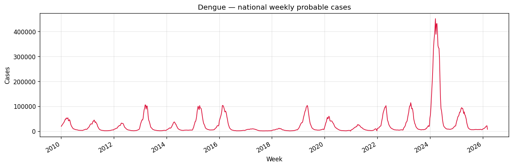

*National weekly total of probable dengue cases, summed across all municipalities.*

### `chikungunya.csv.gz`

Weekly probable chikungunya cases by municipality.

- **Columns:** `geocode`, `date`, `casos`, `epiweek`, `uf`, `macroregional_geocode`, `regional_geocode`, `uf_code`, … (+10 more)<code>target_city</code>, <code>train_1</code>, <code>target_1</code>, <code>train_2</code>, <code>target_2</code>, <code>train_3</code>, <code>target_3</code>, <code>train_4</code>, <code>target_4</code>, <code>disease</code>
- **Notes:** Same schema as dengue; period starts in 2014.

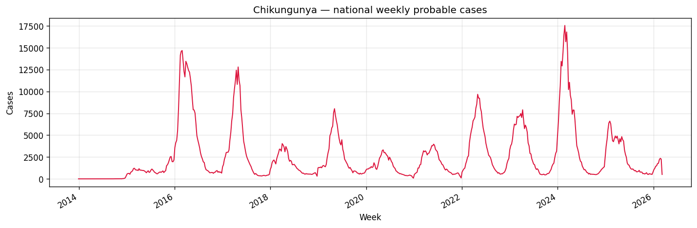

*National weekly total of probable chikungunya cases, summed across all municipalities.*

### `climate.csv`

ERA5 climate reanalysis aggregated to epidemiological weeks per municipality.

- **Columns:** `date`, `epiweek`, `geocode`, `temp_min`, `temp_med`, `temp_max`, `precip_min`, `precip_med`, … (+9 more)<code>precip_max</code>, <code>pressure_min</code>, <code>pressure_med</code>, <code>pressure_max</code>, <code>rel_humid_min</code>, <code>rel_humid_med</code>, <code>rel_humid_max</code>, <code>thermal_range</code>, <code>rainy_days</code>
- **Notes:** Temperature, precipitation, humidity, pressure, thermal range, rainy days.

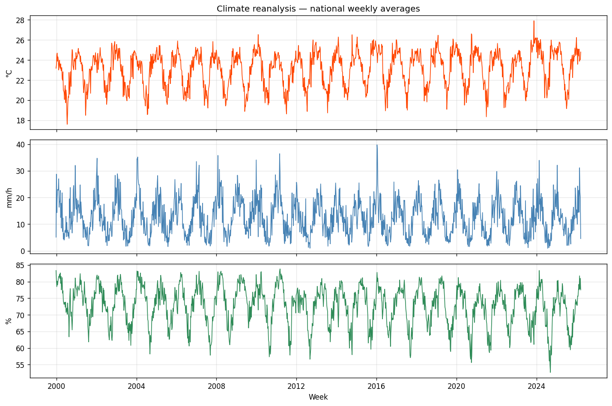

*National weekly averages of mean temperature (°C), precipitation (mm/h), and relative humidity (%), aggregated from ERA5 reanalysis per municipality.*

### `forecasting_climate.csv`

Copernicus seasonal climate forecasts up to six months ahead.

- **Columns:** `geocode`, `reference_month`, `forecast_months_ahead`, `temp_med`, `umid_med`, `precip_tot`
- **Notes:** One row per municipality, reference month, and forecast horizon.

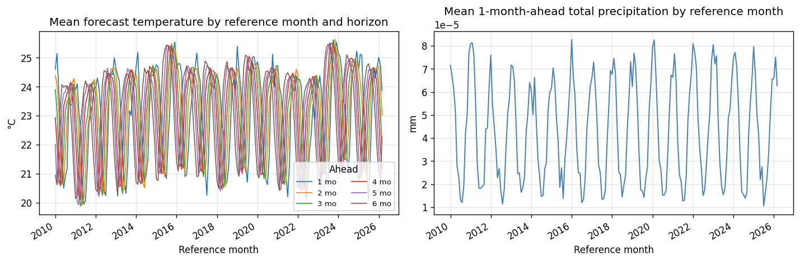

Left: national meanAverage across all municipalities for each reference month and horizon. forecast temperature by reference monthThe month the forecast was issued; shown on the x-axis of the left plot., one line per forecast horizonHow many months ahead the forecast targets; legend labels 1 mo–6 mo. (1–6 months ahead). Right: national mean 1-month-ahead total precipitation by reference month.

### `datasus_population_2001_2025.csv`

Municipality population estimates from DATASUS (2001–2025).

- **Columns:** `geocode`, `year`, `population`
- **Notes:** Long format: geocode × year.

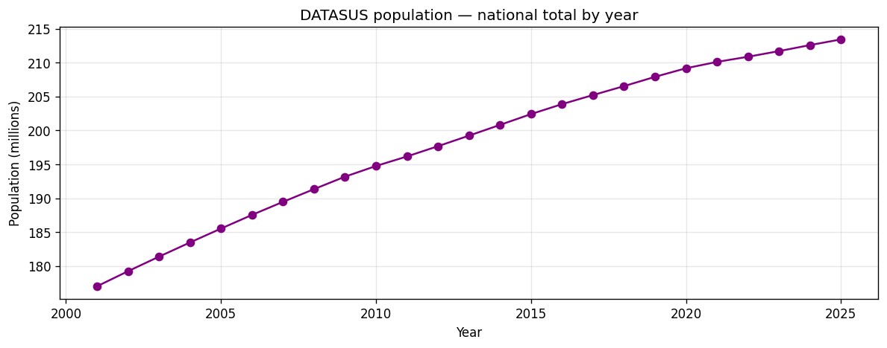

*National population total by year (millions), summed from DATASUS municipality estimates.*

### `environ_vars.csv`

Static environmental descriptors per municipality (Köppen climate, biome).

- **Columns:** `geocode`, `uf_code`, `koppen`, `biome`
- **Notes:** One row per municipality; no time dimension.

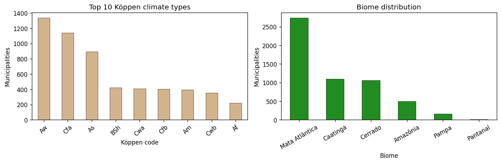

*Left: top 10 Köppen climate types by municipality count. Right: biome distribution across municipalities.*

### `ocean_climate_oscillations.csv`

Weekly ocean-atmosphere oscillation indices (ENSO, IOD, PDO).

- **Columns:** `date`, `enso`, `iod`, `pdo`
- **Notes:** National/global indices; join to case data by week.

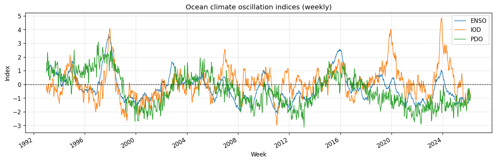

*Weekly ENSO, IOD, and PDO ocean–atmosphere oscillation indices; dashed line at zero.*

### `map_regional_health.csv`

Lookup table linking municipalities to health regions and macroregions.

- **Columns:** `macroregion_code`, `macroregion_name`, `uf_code`, `uf`, `uf_name`, `macroregional_geocode`, `macroregional_name`, `regional_geocode`, … (+3 more)<code>regional_name</code>, <code>geocode</code>, <code>geocode_name</code>
- **Notes:** Use with shapefiles for spatial aggregation.

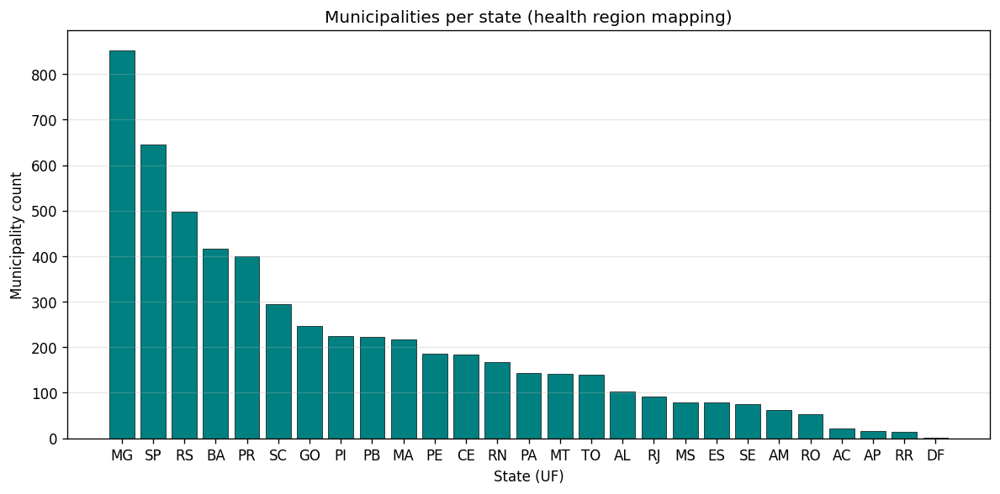

*Number of municipalities per Brazilian state (UF) in the health-region lookup table.*

### `shape_muni.gpkg`

GeoPackage with municipality polygons and names.

- **Columns:** `geocode`, `geocode_name`, `uf`, `uf_code`, `geometry`
- **Notes:** Geometry layer for choropleth maps.

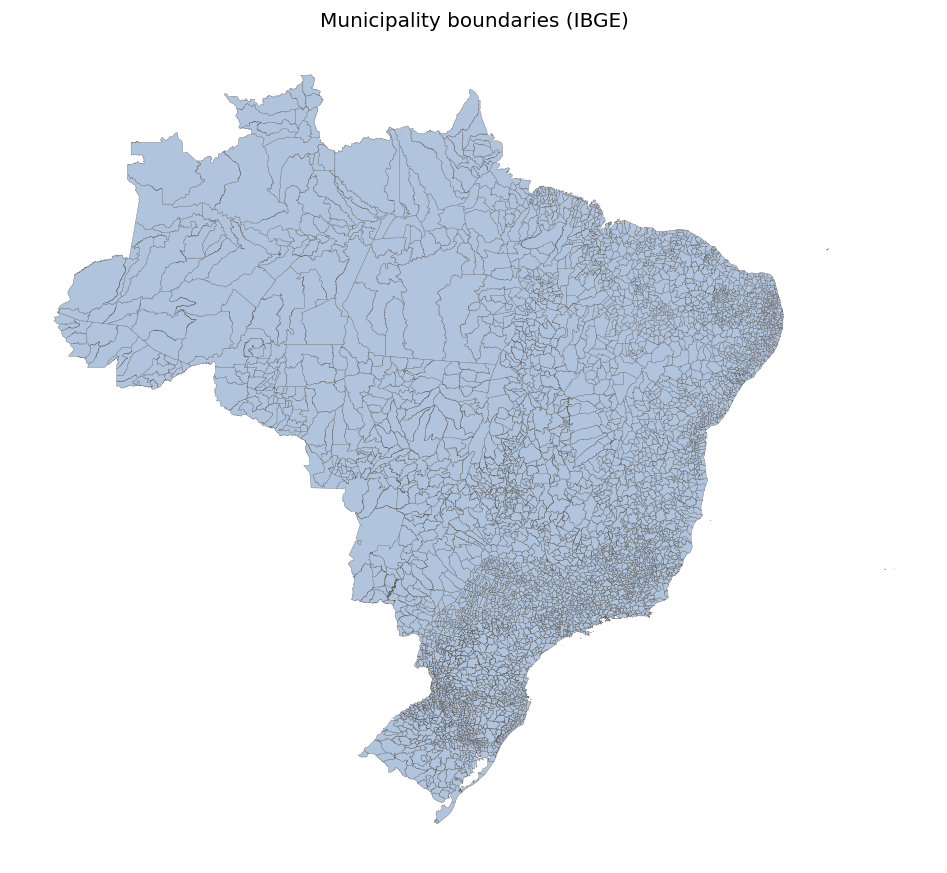

*Map of IBGE municipality polygon boundaries across Brazil.*

### `shape_regional_health.gpkg`

GeoPackage with regional health division polygons.

- **Columns:** `regional_geocode`, `regional_name`, `uf_code`, `geometry`
- **Notes:** Matches regional_geocode in case tables.

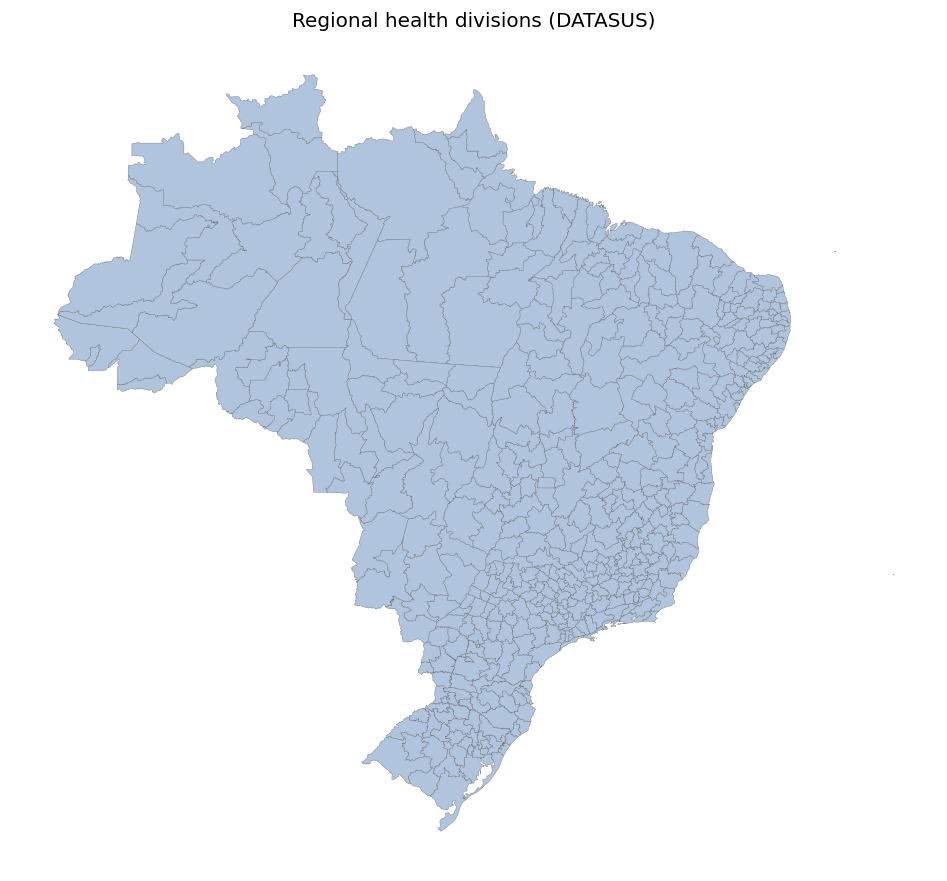

*Map of DATASUS regional health division polygons.*

### `shape_macroregional_health.gpkg`

GeoPackage with macroregional health division polygons.

- **Columns:** `macroregional_geocode`, `macroregional_name`, `uf_code`, `geometry`
- **Notes:** Matches macroregional_geocode in case tables.

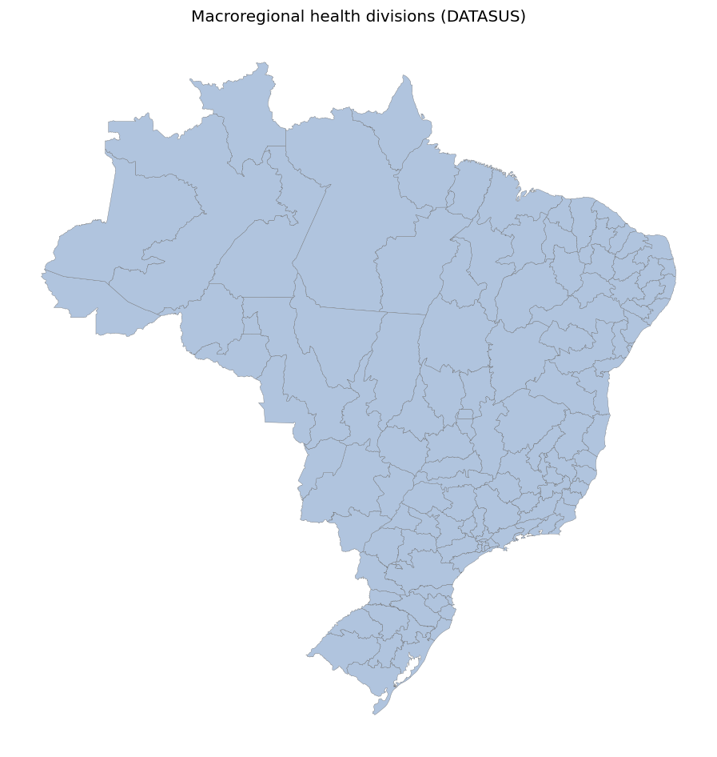

*Map of DATASUS macroregional health division polygons.*

## Compressed copies

These `.csv.gz` files are compressed versions of datasets plotted above (no separate plot):

- `climate.csv.gz`
- `datasus_population_2001_2025.csv.gz`
- `environ_vars.csv.gz`
- `forecasting_climate.csv.gz`
- `ocean_climate_oscillations.csv.gz`

## Next steps

- Join case data with `climate.csv` on `(geocode, epiweek)` or `(geocode, date)`.
- Aggregate to UF or health region using `map_regional_health.csv` and shapefiles.
- Use `forecasting_climate.csv` for horizon-aware climate covariates.
- See [official data documentation](https://sprint.mosqlimate.org/data/) for column definitions.
